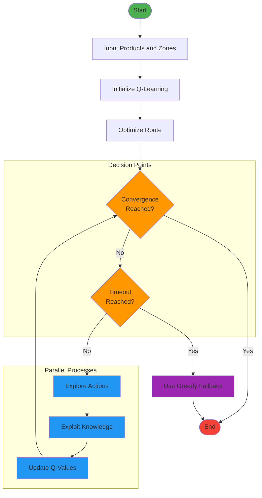

# UML Activity Diagram - Route Optimization Process

```mermaid
flowchart TD
    Start([Start]) --> Input[Input Products and Zones]
    Input --> Init[Initialize Q-Learning]
    Init --> Optimize[Optimize Route]
    
    Optimize --> Check{Convergence<br/>Reached?}
    Check -->|No| Timeout{Timeout<br/>Reached?}
    Timeout -->|No| Explore[Explore Actions]
    Timeout -->|Yes| Greedy[Use Greedy Fallback]
    
    Explore --> Exploit[Exploit Knowledge]
    Exploit --> Update[Update Q-Values]
    Update --> Check
    
    Check -->|Yes| End([End])
    Greedy --> End
    
    subgraph "Parallel Processes"
        Explore
        Exploit
        Update
    end
    
    subgraph "Decision Points"
        Check
        Timeout
    end
    
    style Start fill:#4caf50
    style End fill:#f44336
    style Check fill:#ff9800
    style Timeout fill:#ff9800
    style Explore fill:#2196f3
    style Exploit fill:#2196f3
    style Update fill:#2196f3
    style Greedy fill:#9c27b0
```
