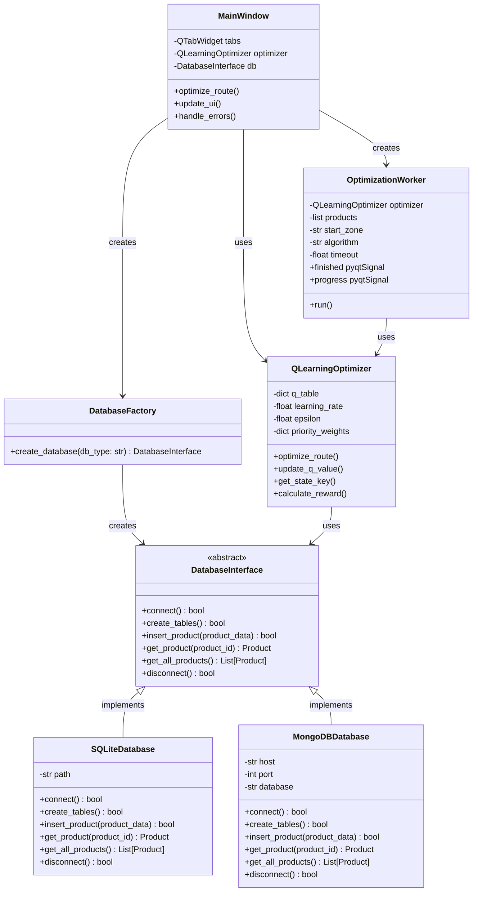

# UML Class Diagram - System Architecture

```mermaid
classDiagram
    class MainWindow {
        -QTabWidget tabs
        -QLearningOptimizer optimizer
        -DatabaseInterface db
        +optimize_route()
        +update_ui()
        +handle_errors()
    }
    
    class QLearningOptimizer {
        -dict q_table
        -float learning_rate
        -float epsilon
        -dict priority_weights
        +optimize_route()
        +update_q_value()
        +get_state_key()
        +calculate_reward()
    }
    
    class DatabaseFactory {
        +create_database(db_type: str) DatabaseInterface
    }
    
    class DatabaseInterface {
        <<abstract>>
        +connect() bool
        +create_tables() bool
        +insert_product(product_data) bool
        +get_product(product_id) Product
        +get_all_products() List[Product]
        +disconnect() bool
    }
    
    class SQLiteDatabase {
        -str path
        +connect() bool
        +create_tables() bool
        +insert_product(product_data) bool
        +get_product(product_id) Product
        +get_all_products() List[Product]
        +disconnect() bool
    }
    
    class MongoDBDatabase {
        -str host
        -int port
        -str database
        +connect() bool
        +create_tables() bool
        +insert_product(product_data) bool
        +get_product(product_id) Product
        +get_all_products() List[Product]
        +disconnect() bool
    }
    
    class OptimizationWorker {
        -QLearningOptimizer optimizer
        -list products
        -str start_zone
        -str algorithm
        -float timeout
        +finished pyqtSignal
        +progress pyqtSignal
        +run()
    }
    
    MainWindow --> QLearningOptimizer : uses
    MainWindow --> DatabaseFactory : creates
    MainWindow --> OptimizationWorker : creates
    DatabaseFactory --> DatabaseInterface : creates
    DatabaseInterface <|-- SQLiteDatabase : implements
    DatabaseInterface <|-- MongoDBDatabase : implements
    QLearningOptimizer --> DatabaseInterface : uses
    OptimizationWorker --> QLearningOptimizer : uses
```
