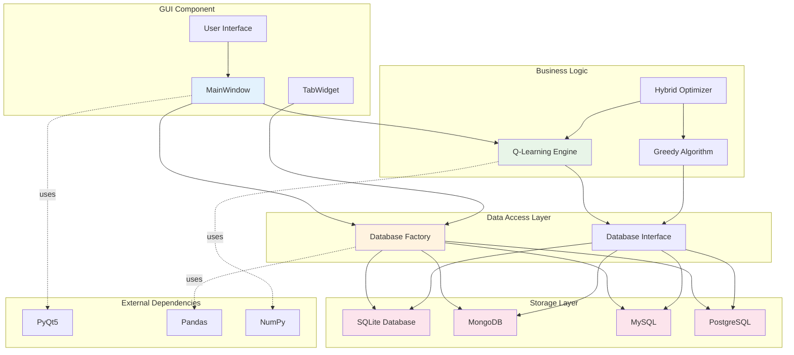

# UML Component Diagram - System Components and Dependencies

```mermaid
graph TB
    subgraph "GUI Component"
        MW[MainWindow]
        TW[TabWidget]
        UI[User Interface]
    end
    
    subgraph "Business Logic"
        QL[Q-Learning Engine]
        GR[Greedy Algorithm]
        HY[Hybrid Optimizer]
    end
    
    subgraph "Data Access Layer"
        DF[Database Factory]
        DI[Database Interface]
    end
    
    subgraph "Storage Layer"
        SQL[SQLite Database]
        MONGO[MongoDB]
        MYSQL[MySQL]
        PG[PostgreSQL]
    end
    
    subgraph "External Dependencies"
        PQ[PyQt5]
        PD[Pandas]
        NP[NumPy]
    end
    
    MW --> QL
    MW --> DF
    TW --> DF
    UI --> MW
    
    QL --> DI
    GR --> DI
    HY --> QL
    HY --> GR
    
    DF --> SQL
    DF --> MONGO
    DF --> MYSQL
    DF --> PG
    
    DI --> SQL
    DI --> MONGO
    DI --> MYSQL
    DI --> PG
    
    MW -.->|uses| PQ
    QL -.->|uses| NP
    DF -.->|uses| PD
    
    style MW fill:#e3f2fd
    style QL fill:#e8f5e8
    style DF fill:#fff3e0
    style SQL fill:#fce4ec
    style MONGO fill:#fce4ec
    style MYSQL fill:#fce4ec
    style PG fill:#fce4ec
```
