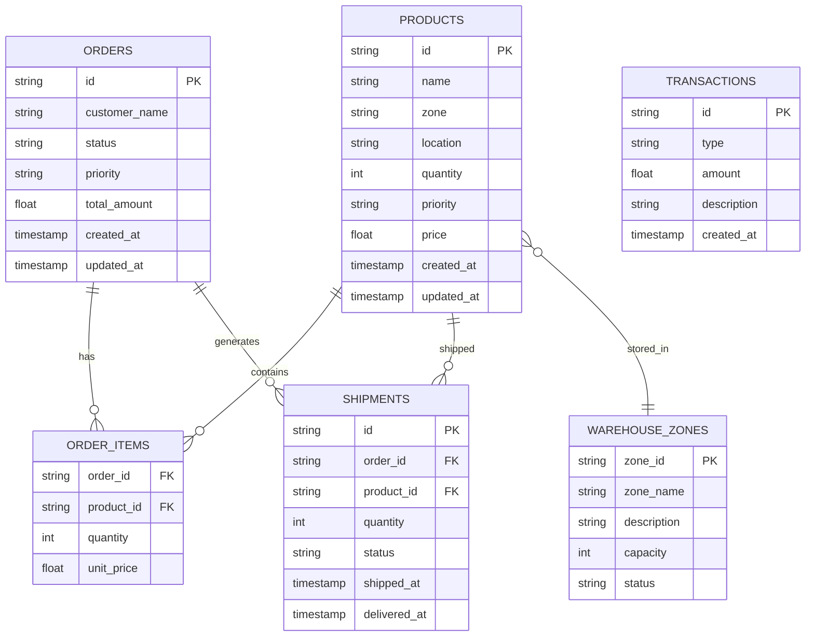

# Entity Relationship Diagram - Database Schema

```mermaid
erDiagram
    PRODUCTS {
        string id PK
        string name
        string zone
        string location
        int quantity
        string priority
        float price
        timestamp created_at
        timestamp updated_at
    }
    
    ORDERS {
        string id PK
        string customer_name
        string status
        string priority
        float total_amount
        timestamp created_at
        timestamp updated_at
    }
    
    ORDER_ITEMS {
        string order_id FK
        string product_id FK
        int quantity
        float unit_price
    }
    
    SHIPMENTS {
        string id PK
        string order_id FK
        string product_id FK
        int quantity
        string status
        timestamp shipped_at
        timestamp delivered_at
    }
    
    TRANSACTIONS {
        string id PK
        string type
        float amount
        string description
        timestamp created_at
    }
    
    WAREHOUSE_ZONES {
        string zone_id PK
        string zone_name
        string description
        int capacity
        string status
    }
    
    PRODUCTS ||--o{ ORDER_ITEMS : "contains"
    ORDERS ||--o{ ORDER_ITEMS : "has"
    ORDERS ||--o{ SHIPMENTS : "generates"
    PRODUCTS ||--o{ SHIPMENTS : "shipped"
    PRODUCTS }o--|| WAREHOUSE_ZONES : "stored_in"
```
