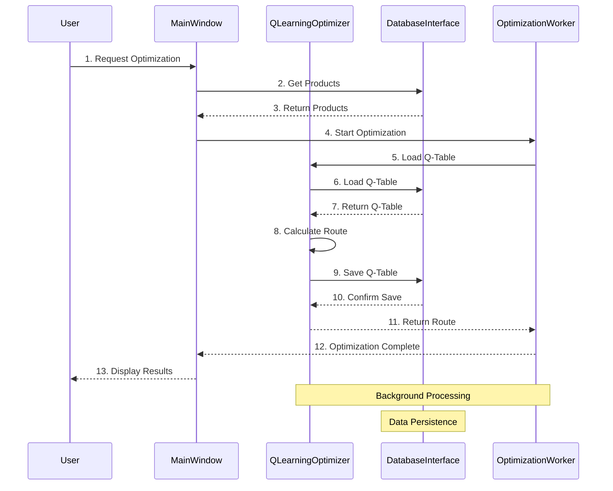

# UML Sequence Diagram - Route Optimization Process

```mermaid
sequenceDiagram
    participant User
    participant GUI as MainWindow
    participant Optimizer as QLearningOptimizer
    participant Database as DatabaseInterface
    participant Worker as OptimizationWorker
    
    User->>GUI: 1. Request Optimization
    GUI->>Database: 2. Get Products
    Database-->>GUI: 3. Return Products
    GUI->>Worker: 4. Start Optimization
    Worker->>Optimizer: 5. Load Q-Table
    Optimizer->>Database: 6. Load Q-Table
    Database-->>Optimizer: 7. Return Q-Table
    Optimizer->>Optimizer: 8. Calculate Route
    Optimizer->>Database: 9. Save Q-Table
    Database-->>Optimizer: 10. Confirm Save
    Optimizer-->>Worker: 11. Return Route
    Worker-->>GUI: 12. Optimization Complete
    GUI-->>User: 13. Display Results
    
    Note over Worker,Optimizer: Background Processing
    Note over Database: Data Persistence
```
