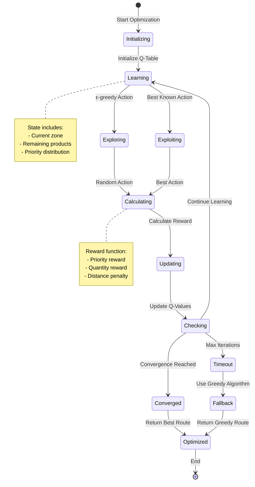

# UML State Diagram - Q-Learning State Machine

```mermaid
stateDiagram-v2
    [*] --> Initializing : Start Optimization
    
    Initializing --> Learning : Initialize Q-Table
    Learning --> Exploring : ε-greedy Action
    Learning --> Exploiting : Best Known Action
    
    Exploring --> Calculating : Random Action
    Exploiting --> Calculating : Best Action
    
    Calculating --> Updating : Calculate Reward
    Updating --> Checking : Update Q-Values
    
    Checking --> Learning : Continue Learning
    Checking --> Converged : Convergence Reached
    Checking --> Timeout : Max Iterations
    
    Converged --> Optimized : Return Best Route
    Timeout --> Fallback : Use Greedy Algorithm
    Fallback --> Optimized : Return Greedy Route
    
    Optimized --> [*] : End
    
    note right of Learning
        State includes:
        - Current zone
        - Remaining products
        - Priority distribution
    end note
    
    note right of Calculating
        Reward function:
        - Priority reward
        - Quantity reward
        - Distance penalty
    end note
```
