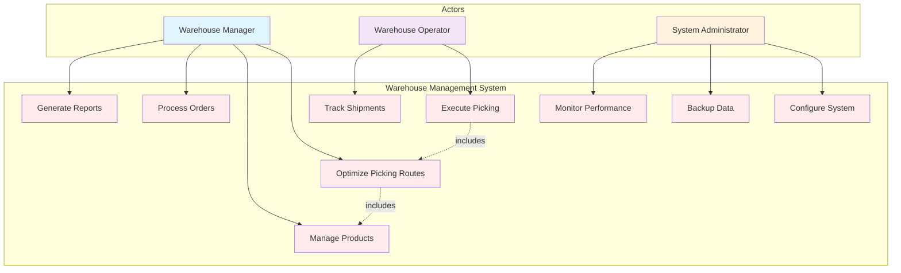

# UML Use Case Diagram - System Actors and Use Cases

```mermaid
graph TB
    subgraph "Warehouse Management System"
        UC1[Optimize Picking Routes]
        UC2[Manage Products]
        UC3[Process Orders]
        UC4[Execute Picking]
        UC5[Track Shipments]
        UC6[Generate Reports]
        UC7[Configure System]
        UC8[Backup Data]
        UC9[Monitor Performance]
    end
    
    subgraph "Actors"
        WM[Warehouse Manager]
        WO[Warehouse Operator]
        SA[System Administrator]
    end
    
    WM --> UC1
    WM --> UC2
    WM --> UC3
    WM --> UC6
    
    WO --> UC4
    WO --> UC5
    
    SA --> UC7
    SA --> UC8
    SA --> UC9
    
    UC1 -.->|includes| UC2
    UC4 -.->|includes| UC1
    
    style WM fill:#e1f5fe
    style WO fill:#f3e5f5
    style SA fill:#fff3e0
    style UC1 fill:#ffebee
    style UC2 fill:#ffebee
    style UC3 fill:#ffebee
    style UC4 fill:#ffebee
    style UC5 fill:#ffebee
    style UC6 fill:#ffebee
    style UC7 fill:#ffebee
    style UC8 fill:#ffebee
    style UC9 fill:#ffebee
```
